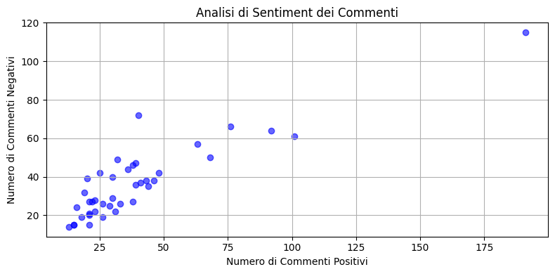
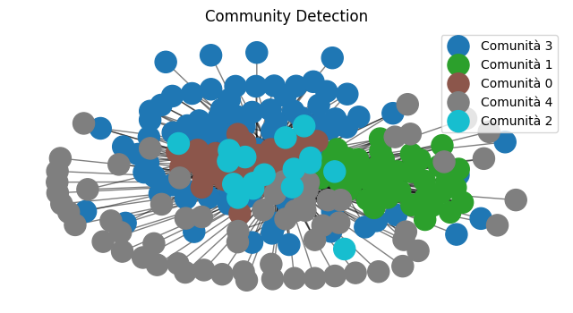
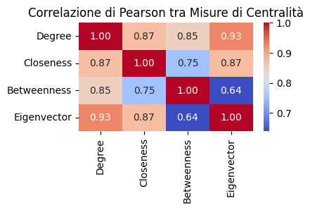

# 🔍 Social Media Analyzer

**AI-powered analysis of YouTube comments** — uncover sentiment, detect emotions, reveal audience clusters and visualize insights through data mining and machine learning.

[](https://deepnote.com/workspace/Social-Media-Mining-Project-7ea5d0be-1b39-4e39-aa40-6413790a6c36/project/Social-Media-Analyzer-Project-to-Analyze-Youtube-Channel-1c0129d4-1c28-4a60-b6a1-1e26bf403598/notebook/Project-14b36c05d5ef42a79c6f1ea232d6936a)

---

## 📌 Overview

This project leverages **YouTube Data API**, **natural language processing**, and **graph-based clustering** to explore the hidden patterns behind user comments on YouTube.

> ✨ From raw comments to structured insights — with a touch of AI.

---

## 📷 Preview

<p align="center">
  
  
  
  
</p>

---

## 🧠 Features

- ✅ Automatic extraction of YouTube video comments  
- 🎯 Sentiment & emotion classification (using [Feel-IT](https://github.com/MilaNLProc/feel-it))  
- 🧩 Community detection via Louvain clustering  
- 📊 Visual analytics and data dashboards  
- 💬 NLP preprocessing with NLTK

---

## 🚀 Quick Start

### 1. Clone the repository
```bash
git clone https://github.com/andrea16martina/social-media-analyzer.git
cd social-media-analyzer
```
### 2. Set up environment
Install required packages:
```bash
pip install -r requirements.txt
```
Download NLTK resources:
```python
import nltk
nltk.download('punkt')
nltk.download('stopwords')
```
3. Launch the notebook
You can run the analysis locally with Jupyter or directly in Deepnote.

---

## 📁 Project Structure

social-media-analyzer/
│
├── notebook/
│   └── analyzer.ipynb
│
├── presentation/
│   └── presentation_SocialMediaAnalyzer.pdf
│
├── graph/
│   ├── pearson_smanalyzer.png
│   ├── sentiment_smanalyzer.png
│   ├── positivity_smanalyzer.png
│   └── clustering_smanalyzer.png
│
├── requirements.txt
├── .gitignore
├── README.md
└── LICENSE

---

## 📦 Tech Stack

| Category        | Tools & Libraries                                                                 |
|----------------|-------------------------------------------------------------------------------------|
| **Language**    | Python                                                                             |
| **APIs**        | [YouTube Data API](https://developers.google.com/youtube/v3)                      |
| **NLP**         | [NLTK](https://www.nltk.org/), [Feel-IT](https://github.com/MilaNLProc/feel-it)  |
| **Graph & Clustering** | [NetworkX](https://networkx.org/), [python-louvain](https://github.com/taynaud/python-louvain) |
| **Visualization** | Matplotlib, Seaborn                                                              |
| **Data Handling** | Pandas, NumPy                                                                    |
| **Dev Tools**   | Git, Deepnote                                                                      |

---

## 📄📄 Presentation
Want a deep dive?
Check out the [presentation (PDF)](./presentation/presentation_SocialMediaAnalyzer.pdf) for a complete breakdown of methods and results.

---

## 👤 Author

**Andrea Martina**  
Computer Science for Digital Communication graduate  
🌐 [GitHub](https://github.com/andrea16martina) | [LinkedIn](https://linkedin.com/in/andmar-7137a41aa)  
📧 andreamartina.dev@gmail.com

If you found this project useful or inspiring, feel free to ⭐ star the repo and connect!

---

## 📜 License
This project is licensed under the MIT License — see the [License](./LICENSE)file for details.


