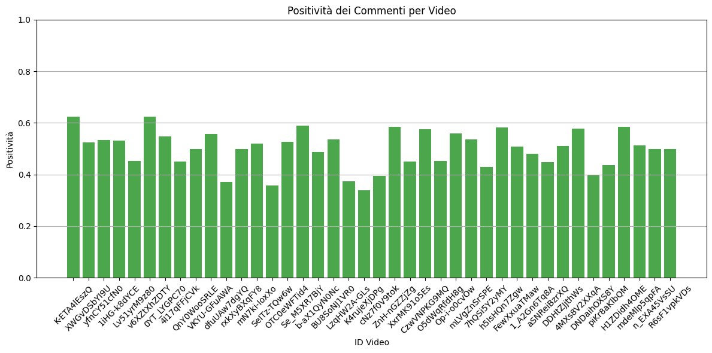

# Social Media Analyzer

Live demo (Deepnote): [Open in Deepnote](https://deepnote.com/workspace/Social-Media-Mining-Project-7ea5d0be-1b39-4e39-aa40-6413790a6c36/project/Social-Media-Analyzer-Project-to-Analyze-Youtube-Channel-1c0129d4-1c28-4a60-b6a1-1e26bf403598/notebook/Project-14b36c05d5ef42a79c6f1ea232d6936a)

## Overview

Social Media Analyzer is a data mining and NLP project for analyzing YouTube video comments.  
It extracts raw comments via the YouTube Data API, processes them with natural language processing pipelines, and applies sentiment/emotion classification and clustering.  
The results are presented through correlation graphs, sentiment distributions, and trend visualizations.

The project is notebook-based and intended as a reference for exploring audience engagement and discourse patterns.

## Key features

- Automated extraction of YouTube comments (via YouTube Data API)  
- Sentiment and emotion classification using [Feel-IT](https://github.com/MilaNLProc/feel-it)  
- Community detection with Louvain clustering (NetworkX + python-louvain)  
- Visualization of correlations, sentiment distribution, clustering and trends  
- Preprocessing with NLTK (tokenization, stopword removal)

## Preview

<p align="center">
  
  
  
  
</p>


## Architecture notes

- Data ingestion via YouTube Data API v3.  
- NLP preprocessing with NLTK.  
- Sentiment/emotion classification powered by Feel-IT.  
- Graph-based community detection implemented with Louvain clustering.  
- Visualizations with Matplotlib/Seaborn.  
- Workflows run inside Jupyter or Deepnote notebooks.

## Local setup

Requirements: Python 3.9+, pip

Clone and install:

```bash
git clone https://github.com/andrea16martina/social-media-analyzer.git
cd social-media-analyzer
pip install -r requirements.txt
```

Download NLTK resources

```python
import nltk
nltk.download('punkt')
nltk.download('stopwords')
```

Run analysis locally in Jupyter, or open directly in Deepnote using the link above.

## Suggested next steps

- Extend support to multiple languages beyond Italian (Feel-IT default).
- Add parameterization for reusable workflows (notebook → script/module).
- Improve visualizations with interactive dashboards (Plotly, Streamlit).
- Add unit tests for data preprocessing functions.

## Contact & License

Author: [Andrea Martina](https://andreamartina.vercel.app)
License: MIT
